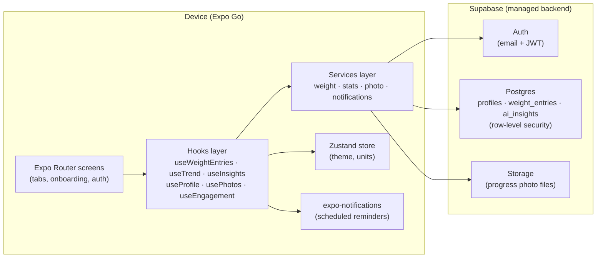
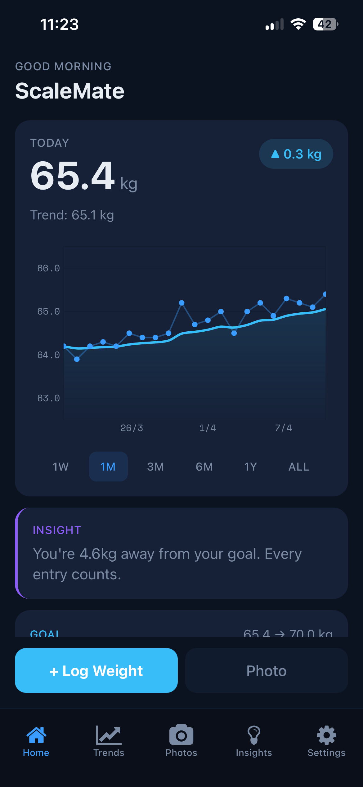
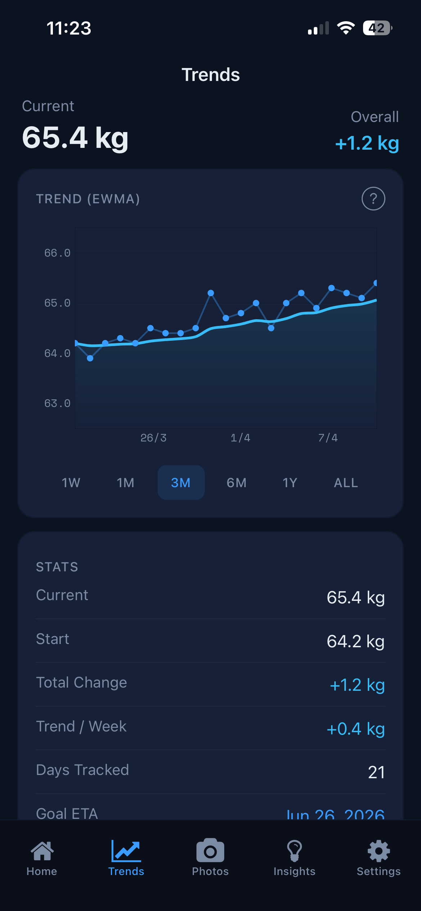
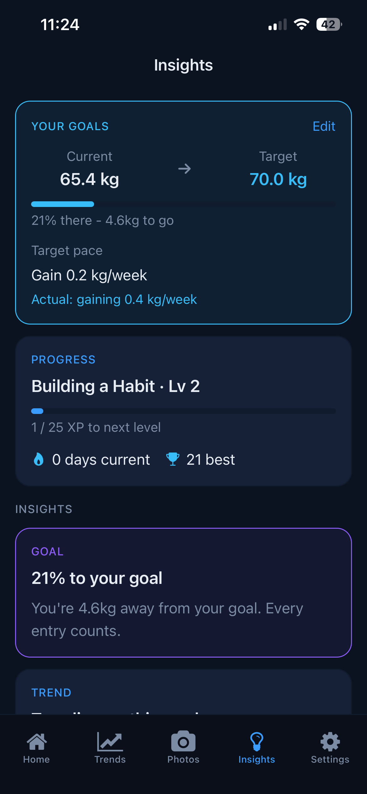
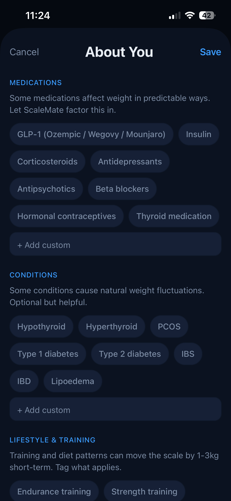
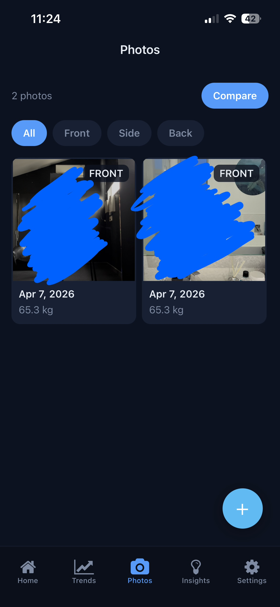
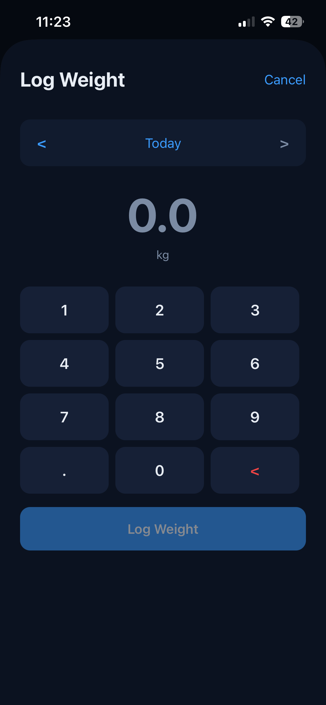

# ScaleMate — Personalized Weight Tracking App

## What it is

ScaleMate is a working React Native concept that tracks daily weight and surfaces context-aware insights based on what each user is dealing with — GLP-1 medications, menstrual cycle tracking, thyroid conditions, and more. It runs entirely in Expo Go on iOS and Android, backed by a Supabase Postgres database with row-level security.

## Why I built it

Most weight-tracking apps assume one model: down is good, up is bad. That model fails real users — GLP-1 plateaus are a normal part of how the medication works, hormonal cycles drive 1–3 kg of water-retention swings, and a single noisy day means almost nothing on its own. ScaleMate explores what happens when the insights engine actually knows your context.

## How it was built

I built this using Claude Code (Anthropic's AI coding agent) as my coding tool, directing every decision end-to-end: what the app does, how it should feel, which tradeoffs to make, and when to stop. The code itself was largely AI-generated under my direction — the product choices, architectural calls, and design decisions described below are mine.

## Tech stack

- **React Native 0.81** + **Expo SDK 54** (runs in Expo Go, no custom native build required)
- **TypeScript** end-to-end
- **Expo Router 6** — file-based routing for screens
- **Supabase** — Postgres with row-level security, Auth, Storage for progress photos
- **Victory Native + Shopify Skia** — GPU-accelerated weight trend chart
- **Zustand** — local UI state (theme, units)
- **expo-notifications** — daily weigh-in reminders + engagement nudges
- **expo-camera** + **expo-image-picker** — progress photo capture
- **date-fns** — date math throughout the trend pipeline

## Key features

- **Daily weight logging** with EWMA-smoothed trend chart so noisy daily readings don't obscure the real trajectory
- **Context-aware insights engine** — surfaces GLP-1 plateau explanations, cycle-related fluctuation reassurance, and thyroid-aware nudges based on profile context
- **Goal-aware color system** — "good" and "bad" colors swap meaning depending on whether the user is losing, gaining, or maintaining
- **Progress photos** with side-by-side comparison and timeline view
- **Engagement loop** — streaks, levels, milestone notifications scheduled locally via `expo-notifications`

## Architecture

## Key design decisions

### EWMA trend smoothing reconciled across multiple display surfaces

Daily weight is genuinely noisy — water retention can swing readings ±2 kg overnight, which makes a raw line chart misleading. The design uses an exponentially weighted moving average so today's reading still matters more than last month's, but no single day dominates. The harder problem wasn't the math — it was noticing that the Home screen's "trend" number and the Trends chart's drawn line had drifted apart as each surface evolved independently. The fix was to consolidate EWMA into a single hook both surfaces consume, plus an in-app explainer modal so users understand why the smoothed line differs from their individual data points.

### Context-aware insights without an LLM

The insights engine is a rule-based pipeline that reads each user's profile context (medications, conditions, cycle tracking, lifestyle factors) and pattern-matches it against their weight history. When someone on GLP-1 medication hits a 7-day plateau, it surfaces a plateau-normalization message; when cycle tracking is on and a short-term spike appears, it explains hormonal water retention rather than flagging it as regression. The deliberate choice not to use an LLM here keeps insights fully explainable, runs them locally with zero per-user cost, and avoids the "black box AI" pattern that erodes trust in weight-tracking specifically. An LLM layer could slot in later for freeform follow-ups, but the rule-based core does the heavy lifting.

## Screenshots

  
  
  

  
  
  

## Status

Working concept. Development paused in April 2026. Kept as a portfolio piece demonstrating full-stack mobile development with React Native, Expo, and Supabase.
